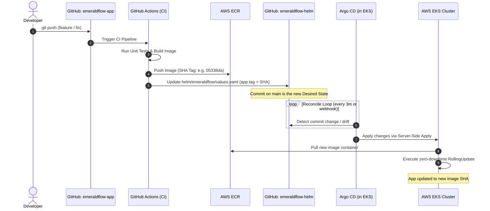

# EmeraldFlow — Helm & GitOps Repository


> **GitOps Single Source of Truth (SSOT) for the EmeraldFlow application.**  
> This repository acts as the declarative state controller for all Kubernetes workloads deployed to Amazon EKS. Argo CD continuously reconciles the live cluster state against the configurations defined in this repository — making every deployment auditable, version-controlled, automated, and self-healing.

---

## Table of Contents

- [Overview & Architecture](#overview--architecture)
- [Cross-Repository References](#cross-repository-references)
- [Directory Layout](#directory-layout)
- [GitOps Delivery Mechanism](#gitops-delivery-mechanism)
  - [Pull-Based GitOps Workflow](#pull-based-gitops-workflow)
  - [Push vs. Pull GitOps Security Model](#push-vs-pull-gitops-security-model)
- [Argo CD Configuration Details](#argo-cd-configuration-details)
  - [AppProject (`argocd/projects/emeraldflow-project.yaml`)](#appproject-argocdprojectsemeraldflow-projectyaml)
  - [Application (`argocd/apps/emeraldflow-app.yaml`)](#application-argocdappsemeraldflow-appyaml)
- [Helm Chart & `values.yaml` Reference](#helm-chart--valuesyaml-reference)
  - [Configuration Breakdown](#configuration-breakdown)
  - [Production Secrets Management](#production-secrets-management)
- [Local Verification & Linting](#local-verification--linting)
- [Bootstrapping Argo CD](#bootstrapping-argo-cd)

---

## Overview & Architecture

In modern cloud-native platform engineering, the GitOps pattern separates infrastructure provisioning, application development, and declarative deployment configurations into decoupled domains.

This repository holds a single, dedicated responsibility: **defining and controlling what runs on the Kubernetes cluster**.

```
+-------------------------------------------------------------------------------+
|                             EmeraldFlow Platform                              |
+--------------------------+----------------------------+-----------------------+
|  Infrastructure (IaC)    |  Application Code & CI     |  GitOps & Deployment  |
|  emeraldflow-infra       |  emeraldflow-app           |  emeraldflow-helm     |
|  (Terraform -> AWS EKS)  |  (GitHub Actions -> ECR)   |  (Argo CD -> Cluster) |
+--------------------------+----------------------------+-----------------------+
```

| Concern | Authoritative Source | Technology |
|:---|:---|:---|
| AWS VPC, Subnets, EKS Cluster, IAM | `emeraldflow-infra` | Terraform |
| Source code, Unit Tests, Dockerfile, CI | `emeraldflow-app` | Python / Java, GitHub Actions, ECR |
| Kubernetes Manifests, Helm Charts, GitOps | `emeraldflow-helm` (this repo) | Helm 3, Argo CD |

---

## Cross-Repository References

| Repository | Role & Responsibility | Repository Link |
|:---|:---|:---|
| **`emeraldflow-infra`** | Provisions AWS EKS cluster, VPC, networking, node groups, and IAM roles via Terraform | [Raphonkzy/emeraldflow-infra](https://github.com/Raphonkzy/emeraldflow-infra) |
| **`emeraldflow-app`** | Application source code, test suites, Dockerfile, and GitHub Actions CI pipelines | [Raphonkzy/emeraldflow-app](https://github.com/Raphonkzy/emeraldflow-app) |
| **`emeraldflow-helm`** | Helm packaging, environment configurations, and Argo CD GitOps manifests *(this repository)* | [Raphonkzy/emeraldflow-helm](https://github.com/Raphonkzy/emeraldflow-helm) |

---

## Directory Layout

```
emeraldflow-helm/
|-- argocd/                                 # Declarative Argo CD Custom Resources
|   |-- apps/
|   |   \-- emeraldflow-app.yaml           # Application CR (sync policy, target cluster)
|   \-- projects/
|       \-- emeraldflow-project.yaml       # AppProject CR (RBAC boundaries, allowed sources)
|
|-- helm/
|   \-- emeraldflow/                       # Production Umbrella Helm Chart
|       |-- Chart.yaml                     # Chart metadata (name, chart version, appVersion)
|       |-- values.yaml                    # Declarative configuration parameters & image tags
|       \-- templates/
|           |-- app-deployment.yaml        # Web application Deployment & InitContainers
|           |-- db-deployment.yaml         # MySQL database Deployment
|           |-- mc-deployment.yaml         # Memcached caching service Deployment
|           |-- rmq-deployment.yaml        # RabbitMQ message broker Deployment
|           |-- services.yaml              # ClusterIP Services for all internal tiers
|           |-- ingress.yaml               # AWS ALB Ingress (HTTPS termination with ACM)
|           |-- pvc.yaml                   # PersistentVolumeClaim for database storage
|           |-- secret.yaml                # Kubernetes Secret manifest
|           \-- dockerregistry-secret.yaml # ImagePullSecret (if using private registries)
|
|-- kubedefs/                              # Reference standalone Kubernetes manifests
|   |-- appdeploy.yaml
|   |-- appingress.yaml
|   |-- appservice.yaml
|   |-- dbdeploy.yaml
|   |-- dbpvc.yaml
|   |-- dbservice.yaml
|   |-- mcdep.yaml
|   |-- mcservice.yaml
|   |-- rmqdeploy.yaml
|   |-- rmqservice.yaml
|   \-- secret.yaml
|
|-- .gitignore
\-- README.md
```

> **Note on `kubedefs/` vs. `helm/emeraldflow/`:**  
> The `kubedefs/` directory contains static baseline Kubernetes YAML manifests utilized during exploratory testing and course labs. The authoritative, production-grade deployment artifact managed by Argo CD is the Helm chart in `helm/emeraldflow/`.

---

## GitOps Delivery Mechanism

### Pull-Based GitOps Workflow

EmeraldFlow implements an automated, pull-based GitOps reconciliation cycle. The cluster continuously pulls its target state from Git rather than having external systems push changes directly into the cluster.



### Push vs. Pull GitOps Security Model

| Feature | Push-Based CI/CD (Traditional) | Pull-Based GitOps (EmeraldFlow / Argo CD) |
|:---|:---|:---|
| **Cluster Access** | CI runners require long-lived cluster admin credentials / kubeconfig | **Zero cluster credentials** in CI runners; Argo CD runs natively inside EKS |
| **Firewall / Network** | Cluster API endpoint must be exposed to CI agents (or complex VPNs) | Cluster API remains private; Argo CD pulls outbound via HTTPS/SSH to Git |
| **Configuration Drift** | Manual `kubectl` edits stay undetected until next CI run overwrites it | **Immediate drift detection & auto-healing** restores state within minutes |
| **Audit Trail** | Fragmented across CI runner logs and cloud provider events | **Git commit log** is the unified audit trail for all changes |
| **Rollback Mechanism** | Triggering another pipeline rerun or manual deployment | `git revert <commit>` triggers instant, automated rollback |

By adopting pull-based GitOps with Argo CD:
1. **Attack Surface Reduction:** CI pipelines only have permission to push images to AWS ECR and commit configuration updates to `emeraldflow-helm`. No CI compromise can grant cluster administrative access.
2. **Deterministic State:** If an engineer accidentally deletes a Service or modifies pod counts via `kubectl`, Argo CD's `selfHeal` mechanism instantly detects drift and re-applies the Git-defined specification.

---

## Argo CD Configuration Details

Argo CD manages workloads through two primary Custom Resource Definitions (CRDs): `AppProject` and `Application`.

### AppProject (`argocd/projects/emeraldflow-project.yaml`)

The `AppProject` resource enforces strict RBAC boundaries and tenant isolation for the EmeraldFlow workload:

```yaml
apiVersion: argoproj.io/v1alpha1
kind: AppProject
metadata:
  name: emeraldflow
  namespace: argocd
spec:
  description: emeraldflow application project
  sourceRepos:
    - git@github.com:Raphonkzy/emeraldflow-helm.git
  destinations:
    - namespace: emeraldflow
      server: https://kubernetes.default.svc
  clusterResourceWhitelist:
    - group: ""
      kind: Namespace
  namespaceResourceWhitelist:
    - group: "*"
      kind: "*"
```

- **Restricted Source Repos (`sourceRepos`)**: The project can only consume configurations from `git@github.com:Raphonkzy/emeraldflow-helm.git`. Unauthorized repositories cannot be synchronized.
- **Restricted Target Destinations (`destinations`)**: Applications governed by this project can only deploy to the `emeraldflow` namespace on the in-cluster API server (`https://kubernetes.default.svc`).
- **Cluster Resource Whitelist (`clusterResourceWhitelist`)**: Cluster-scoped permissions are strictly restricted to `Namespace` creation. Prevents accidental or unauthorized modifications to Nodes, ClusterRoles, or CRDs.
- **Namespace Resource Whitelist (`namespaceResourceWhitelist`)**: Permits any namespaced resource (`Deployments`, `Services`, `Ingress`, `Secrets`, `PVCs`) within the permitted namespace.

### Application (`argocd/apps/emeraldflow-app.yaml`)

The `Application` manifest connects the source Git repository to the target Kubernetes cluster:

```yaml
apiVersion: argoproj.io/v1alpha1
kind: Application
metadata:
  name: emeraldflow
  namespace: argocd
  finalizers:
    - resources-finalizer.argocd.argoproj.io
spec:
  project: emeraldflow
  source:
    repoURL: git@github.com:Raphonkzy/emeraldflow-helm.git
    targetRevision: main
    path: helm/emeraldflow
    helm:
      valueFiles:
        - values.yaml
  destination:
    server: https://kubernetes.default.svc
    namespace: emeraldflow
  syncPolicy:
    automated:
      prune: true
      selfHeal: true
    syncOptions:
      - CreateNamespace=true
      - ServerSideApply=true
```

- **`finalizers: [resources-finalizer.argocd.argoproj.io]`**: Enables cascading deletion. If the Argo CD application is deleted, all managed resources inside the cluster are cleanly terminated.
- **`syncPolicy.automated.prune: true`**: Automatically deletes Kubernetes resources that have been removed from the Git repository, preventing orphan resources.
- **`syncPolicy.automated.selfHeal: true`**: Reconciles live cluster state back to Git state if any manual or out-of-band modifications occur.
- **`syncOptions.CreateNamespace=true`**: Automatically creates the `emeraldflow` target namespace if it does not already exist upon initial deployment.
- **`syncOptions.ServerSideApply=true`**: Leverages Kubernetes Server-Side Apply for superior conflict resolution and handling of large manifests/annotations.

---

## Helm Chart & `values.yaml` Reference

The Helm chart in `helm/emeraldflow/` acts as an umbrella chart orchestrating all components of the multi-tier application.

### Configuration Breakdown

All configurable parameters reside in [`helm/emeraldflow/values.yaml`](./helm/emeraldflow/values.yaml):

#### Application Service (`app`)
| Parameter | Default | Description |
|:---|:---|:---|
| `app.image` | `170202974463.dkr.ecr.us-east-1.amazonaws.com/emeraldflow-app` | ECR repository containing the application container image |
| `app.tag` | `05338da05f32f070e8577b2ea723701abd2b20c3` | Image tag (immutable Git SHA updated automatically by CI) |
| `app.replicas` | `1` | Pod replica count |
| `app.containerPort` | `8080` | Internal application listening port |
| `app.servicePort` | `8080` | ClusterIP Service exposed port |

#### Init Containers (`initcontainers`)
| Parameter | Default | Description |
|:---|:---|:---|
| `initcontainers.image` | `busybox` | Lightweight utility image for dependency checking |
| `initcontainers.tag` | `latest` | Image tag for init container |
*InitContainers enforce start ordering: the web application waits for DNS resolution of `emeraldflow-db` and `emeraldflow-mc` before booting.*

#### Database Tier - MySQL (`db`)
| Parameter | Default | Description |
|:---|:---|:---|
| `db.image` | `emeraldflow-db` | Container image containing MySQL with pre-loaded database schema |
| `db.tag` | `latest` | Database image tag |
| `db.replicas` | `1` | Replicas (stateful singleton) |
| `db.containerPort` | `3306` | MySQL port |
| `db.servicePort` | `3306` | Database ClusterIP port |
| `db.storageClass` | `gp2` | EBS CSI driver StorageClass |
| `db.storageSize` | `3Gi` | Persistent Volume capacity |

#### Cache Tier - Memcached (`memcached`)
| Parameter | Default | Description |
|:---|:---|:---|
| `memcached.image` | `memcached` | Official Memcached container image |
| `memcached.tag` | `latest` | Memcached image tag |
| `memcached.replicas` | `1` | Number of cache instances |
| `memcached.containerPort` | `11211` | In-memory cache port |
| `memcached.servicePort` | `11211` | Service port |

#### Message Broker Tier - RabbitMQ (`rabbitmq`)
| Parameter | Default | Description |
|:---|:---|:---|
| `rabbitmq.image` | `rabbitmq` | Official RabbitMQ message broker image |
| `rabbitmq.tag` | `latest` | RabbitMQ image tag |
| `rabbitmq.replicas` | `1` | Replicas |
| `rabbitmq.containerPort` | `5672` | AMQP protocol port |
| `rabbitmq.servicePort` | `5672` | Service port |
| `rabbitmq.defaultUser` | `guest` | Default AMQP username |

#### Ingress & TLS Termination (`ingress`)
| Parameter | Default | Description |
|:---|:---|:---|
| `ingress.enabled` | `true` | Enables/disables creation of the Ingress resource |
| `ingress.host` | `emeraldflow.raphonkzy.my.id` | FQDN routed to the AWS Application Load Balancer |
| `ingress.servicePort` | `8080` | Backend target Service port |
| `ingress.certificateArn` | `arn:aws:acm:us-east-1:...` | AWS ACM Certificate ARN for HTTPS termination |

*The Ingress template provisions an AWS ALB with automated HTTP-to-HTTPS redirect (`ssl-redirect: '443'`) and `target-type: ip`.*

#### Registry Authentication (`dockerregistry`)
| Parameter | Default | Description |
|:---|:---|:---|
| `dockerregistry.enabled` | `false` | Set to `true` if pulling images from private registries |
| `dockerregistry.server` | `https://index.docker.io/v1/` | Container registry URL |
| `dockerregistry.username` | `""` | Registry username (keep empty in Git) |
| `dockerregistry.password` | `""` | Registry token/password (keep empty in Git) |

*(Disabled by default because AWS EKS worker nodes authenticate to Amazon ECR seamlessly via IAM instance profiles and IRSA).*

---

### Production Secrets Management

> [!WARNING]
> **Never commit production credentials or raw secrets to Git.**  
> The sample values in `secrets.dbPassword` and `secrets.rmqPassword` exist strictly for sandbox/local evaluation.

For secure production GitOps workflows, adopt one of the following industry-standard approaches:

1. **External Secrets Operator (ESO) + AWS Secrets Manager (Recommended):**
   - Store real database passwords in AWS Secrets Manager or SSM Parameter Store.
   - Install `external-secrets` operator in EKS.
   - Commit declarative `SecretStore` and `ExternalSecret` manifests to Git that reference IAM roles (IRSA) to dynamically fetch secrets into Kubernetes `Secret` objects.
2. **Sealed Secrets by Bitnami:**
   - Encrypt secrets using an asymmetric public key known only to the cluster controller.
   - Commit `SealedSecret` custom resources safely to public/private Git repositories.
3. **HashiCorp Vault Agent Injector:**
   - Inject secrets directly into pod filesystems or memory at runtime using Vault sidecar annotations.

---

## Local Verification & Linting

Before pushing changes or opening a Pull Request, validate the Helm chart syntax and template output locally:

### 1. Lint the Helm Chart

Validates `Chart.yaml`, template syntax, and checks for formatting errors:

```bash
helm lint helm/emeraldflow/
```

Expected output:
```text
==> Linting helm/emeraldflow/
[INFO] Chart.yaml: icon is recommended

1 chart(s) linted, 0 chart(s) failed
```

### 2. Render and Inspect Templates

Renders templates locally with default values to verify generated Kubernetes manifests:

```bash
helm template emeraldflow helm/emeraldflow/ --debug
```

### 3. Test with Custom Overrides

Verify rendering when overriding specific values (e.g., simulating a CI image tag update):

```bash
helm template emeraldflow helm/emeraldflow/ \
  --set app.tag=test-build-123 \
  --set app.replicas=2
```

### 4. Server-Side Dry Run (Requires Active Cluster Context)

Validates rendered manifests against the Kubernetes API schema without persisting any changes:

```bash
helm template emeraldflow helm/emeraldflow/ | kubectl apply --dry-run=server -f -
```

---

## Bootstrapping Argo CD

Follow these steps to bootstrap the GitOps pipeline on a freshly provisioned AWS EKS cluster.

### Prerequisites

- AWS EKS Cluster running and authenticated (`kubectl get nodes`).
- AWS Load Balancer Controller installed on the cluster.
- Argo CD installed in the `argocd` namespace.

```bash
# Verify Argo CD is running
kubectl get pods -n argocd
```

### Step 1 — Register the AppProject

Apply the project manifest to establish RBAC boundaries:

```bash
kubectl apply -f argocd/projects/emeraldflow-project.yaml
```

Verify the project creation:
```bash
kubectl get appproject -n argocd
```

### Step 2 — Register the Application

Apply the application manifest to initiate GitOps reconciliation:

```bash
kubectl apply -f argocd/apps/emeraldflow-app.yaml
```

Argo CD will automatically create the `emeraldflow` namespace, parse the Helm chart, pull images, and deploy all workloads.

### Step 3 — Monitor and Verify Synchronization

Watch the synchronization status in real-time:

```bash
# Watch application sync status via kubectl
kubectl get application emeraldflow -n argocd -w

# Or inspect application status via Argo CD CLI
argocd app get emeraldflow

# If needed, trigger a manual refresh or sync
argocd app sync emeraldflow
```

Check the deployed workloads in the target namespace:

```bash
kubectl get all,ingress,pvc -n emeraldflow
```

### Step 4 — Access the Application

Once the AWS Load Balancer Controller provisions the ALB, retrieve the Ingress address:

```bash
kubectl get ingress emeraldflow-ingress -n emeraldflow
```

Point your DNS record (Route 53) to the provisioned ALB DNS name, and access the application at `https://emeraldflow.raphonkzy.my.id`.

---

<div align="center">
  <sub>Part of the <b>EmeraldFlow</b> Cloud-Native DevOps Portfolio Project</sub><br>
  <sub>Kubernetes Declarative State Engine &bull; Managed via Argo CD &amp; Helm on Amazon EKS</sub>
</div>
